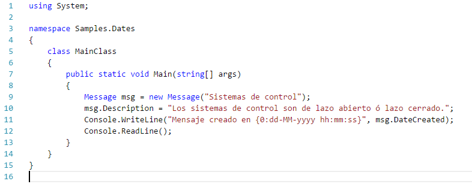

# Diferencias entre C# DateTime.Now y DateTime.Today

Hoy por la tarde haciendo un programa para enviar mensajes hacia un servidor me salió un error simple que después de cierto tiempo pude resolverlo y se debió más a un bloqueo de mi memoria que ha otro factor.
Resulta que uno de los requisitos en el programa era enviar como título del mensaje fecha, hora, minutos y segundos en los que cada mensaje se había generado.
Básicamente existía una clase mensaje con una propiedad DateCreated como en el siguiente código:

Al crear el mensaje, el programa debía notificar con un aviso, indicando fecha, hora, minutos y segundos, algo así como lo siguiente:

<pre>
“Mensaje recibido 24-02-2011 a las 22:04:12”
</pre>

Sin embargo el mensaje lo notificaba de la siguiente forma:

<pre>
“Mensaje recibido 24-02-2011 a las 22:04:00 ”
</pre>

El código principal era más o menos asi

Al revisar el código descubrí que al usar la estructura DateTime utilice la propiedad Today en lugar de la propiedadNow .
Ambas propiedades obtienen el valor de la fecha actual, la diferencia es que en Today la parte correspondiente al tiempo se establece en 00:00:00.

Al cambiar la propiedad DateCreated como en la siguiente línea:

<pre>
public DateTime DateCreated
{
   get{ return DateTime.Now;}
}
</pre>

El problema se soluciono y aquí el resultado.

